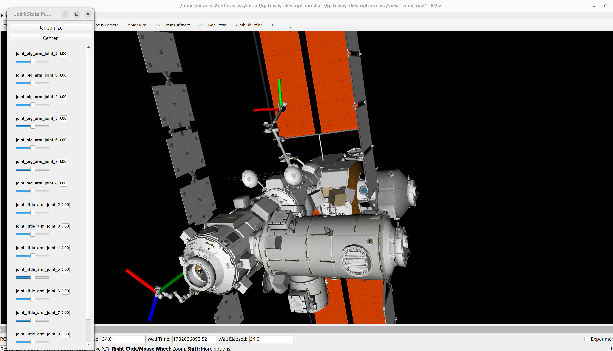

# gateway_demos
Gateway setup for testing Edoras and other robotic projects, backported to ROS1.

Rviz demo:
-------------
Launches a kinematic simulation of Gateway (models originally from the NASA's [3D resources repo](https://github.com/nasa/NASA-3D-Resources/tree/master/3D%20Models/Gateway). The user can use the joint state publisher gui to move any of the 2 robot arms available:

```
ros2 launch gateway_description view_gateway_assembled.launch.py
```

Note we have 2 launch files:
* view_gateway: Loads gateway.urdf.xacro, which defines a single urdf with the gateway body + big arm + little arm.
* view_gateway_assembled: Loads 3 urdf.xacro files, one for the body, one for the big arm and one for the little arm, namespaced. 

Choose whichever suits best your task requirements.

You should see something like this:


